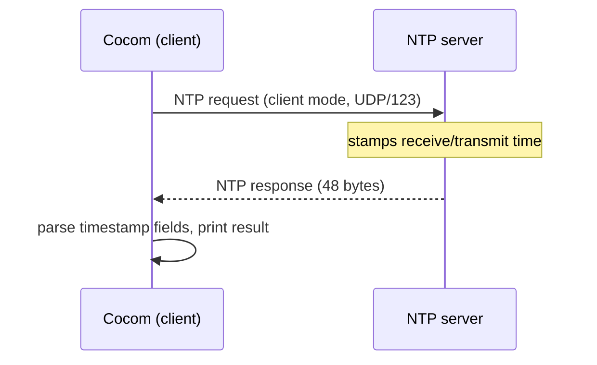

# Cocom

[](https://github.com/LamdaLamdaLamda/cocom/actions/workflows/linux.yml)
[](https://github.com/LamdaLamdaLamda/cocom/actions/workflows/macos.yml)
[](https://github.com/LamdaLamdaLamda/cocom/actions/workflows/docker-image.yml)
[](LICENSE)

Cocom is a minimal [NTP](http://www.ntp.org/) client, written entirely in Rust. It speaks the NTP wire protocol
directly over UDP — no `ntpd`, `chrony`, `systemd-timesyncd`, or third-party NTP library involved.

## Why

- **No system daemon required.** Cocom talks UDP directly to an NTP server, which makes it a good fit for
  embedded targets and minimal Linux environments where running a full NTP daemon isn't practical.
- **Built for systems that need direct control over time sync.** Real-time and signal-processing workloads,
  embedded devices, and other resource-constrained or tightly controlled environments often can't — or
  shouldn't have to — depend on an external system daemon for something as fundamental as clock
  synchronization. Cocom gives you a single, self-contained binary you fully control.
- **Single, portable binary.** As a Rust binary it cross-compiles to x86, ARM, and RISC-V without code changes.
- **Memory-safe by construction.** Unlike `ntpd`/`chrony` (C), packet parsing happens in safe Rust — no
  buffer overflows, no use-after-free.

## Comparison

|                                  | Cocom                                       | `chrony`                     | `ntpd`                        | `systemd-timesyncd`  |
|----------------------------------|----------------------------------------------|-------------------------------|--------------------------------|------------------------|
| Language                        | Rust                                         | C                              | C                               | C                       |
| Memory-safe by design            | Yes                                           | No                              | No                               | No                       |
| Runtime dependency               | None — direct UDP, single binary             | System daemon + config        | System daemon + config         | Requires systemd        |
| Clock offset / drift correction  | Not yet — see [Roadmap](#roadmap)            | Yes                             | Yes                             | Yes                      |
| Typical use                      | One-shot time query, embeddable in other tools | Continuous system clock discipline | Continuous system clock discipline | Continuous system clock discipline |

## When to Use Cocom

Cocom is a good fit when:

- You need to query the current time from an NTP server without installing or configuring a full daemon
- You're building for embedded or minimal Linux targets where `chrony`/`ntpd` aren't available or desired
- You want to embed NTP time queries directly into another Rust program or a larger real-time/signal-processing
  pipeline
- Memory-safety of the client itself is a hard requirement

Cocom is **not** a drop-in replacement for `chrony`/`ntpd`/`systemd-timesyncd` yet:

- It performs a single request/response exchange — it does not continuously discipline the system clock
- Round-trip delay and clock-offset calculation exist as a standalone building block
  ([`src/offset.rs`](src/offset.rs)) but aren't wired into the CLI yet — see [Roadmap](#roadmap)

If you need continuous, drift-corrected time synchronization today, use `chrony` or `ntpd`.

## Features

- Sends an NTP client-mode request (RFC 5905) and parses the 48-byte response packet
- Configurable NTP server (defaults to the [PTB Braunschweig](https://www.ptb.de) time server)
- Configurable UDP bind address
- Verbose and debug output modes for inspecting raw NTP packet fields

> **Note:** Cocom currently performs a single request/response exchange and reports the server's timestamp.
> Round-trip delay/clock-offset calculation and periodic re-synchronization are on the [roadmap](#roadmap)
> but not implemented yet — see the [Changelog](CHANGELOG.md) for what has actually shipped.

## Installation

### Build from source

Requires [`just`](https://just.systems) as the command runner.

```sh
just build && just install
```

This installs Cocom to `/usr/local/bin`; the install step may need elevated privileges. To build and run
without installing:

```sh
just run-dev   # debug build
just run       # release build
```

### Docker

```sh
docker build -t cocom . && docker run cocom
```

## Usage

If no host is given, Cocom queries the default NTP server. With no flags, it prints the received time.

```
NTP-Client purely written in Rust.

Usage: cocom [OPTIONS] [HOST]

Arguments:
  [HOST]  Specifies the desired NTP-server

Options:
  -b, --bind <BIND>  Specifies the binding address for the UDP socket. The following format is required; [IP]:[PORT]
  -v, --verbose      Activates terminal output
  -d, --debug        Prints the fields of the received NTP-packet
  -h, --help         Print help
  -V, --version      Print version
```

Examples:

```sh
$ cocom
2026-08-08 23:07:56.528642832
```

```sh
$ cocom -v pool.ntp.org
[*] Requesting pool.ntp.org:123
[*] Received NTP-data...
[*] Time 1786265691 sec : 396831919 nsec
[*] NTP-Data -->
	Mode - 28
	Stratum - 2
	Poll - 0
	Precision - 233
	Root-Delay - 2091
	Root-Dispersion - 252
	Reference-ID - 1365776101
	Reference-Timestamp - 3995254472:4093032633
	Originate-Timestamp - 0:0
	RX-Timestamp - 3995254491:1704380116
	TX-Timestamp - 3995254491:1704472332
```

```sh
# Bind the UDP socket to a specific local address/port and show raw packet fields
cocom -b 0.0.0.0:12345 -d pool.ntp.org
```

## How it works

Cocom builds a 48-byte NTP packet in client mode, sends it over UDP to the target server's port 123, and
parses the returned packet's timestamp fields. See [RFC 5905, section 7](https://tools.ietf.org/html/rfc5905#section-7)
for the wire format.



## Architecture

| Module           | Responsibility                                                                              |
|-------------------|-----------------------------------------------------------------------------------------------|
| `src/main.rs`     | Entry point; wires CLI parsing to the client and maps errors to process exit codes            |
| `src/parser.rs`   | CLI argument definitions (`clap`) and dispatch to verbose/debug/default output modes           |
| `src/client.rs`   | UDP socket handling: sends the NTP request, receives the response, times out after 5s         |
| `src/ntp.rs`      | The 48-byte NTP packet: (de)serialization and NTP-timestamp ⟷ `Duration` conversions          |
| `src/offset.rs`   | Pure round-trip-delay/clock-offset math ([RFC 5905, section 8](https://tools.ietf.org/html/rfc5905#section-8)), decoupled from I/O — not yet wired into the CLI |

## Precision & Limitations

- Cocom reports the server's transmit timestamp as-is; it does **not** yet correct for network round-trip
  delay or local clock offset (the math for this exists in `src/offset.rs` but isn't wired in — see
  [Roadmap](#roadmap)).
- A single request/response exchange is performed per invocation — no averaging, retry-on-loss, or periodic
  re-synchronization.
- The UDP socket read has a fixed 5-second timeout; on timeout or network error, Cocom exits with a non-zero
  status instead of retrying.

## Roadmap

- [ ] Round-trip delay and clock-offset calculation from the four NTP timestamps
- [ ] Periodic re-synchronization with drift compensation
- [x] Dependency modernization (replace unmaintained/advisory-flagged crates)

## Development

Recipes are defined in the [justfile](justfile) and run via [`just`](https://just.systems).

| Command          | Description                                  |
|------------------|-----------------------------------------------|
| `just build-dev` | Debug build                                   |
| `just build`     | Release build                                 |
| `just run-dev`   | Build and run (debug)                         |
| `just run`       | Build and run (release)                       |
| `just test`      | Run the test suite                            |
| `just doc`       | Generate documentation into `doc/`            |
| `just install`   | Install the release binary to `$PREFIX/bin`   |

## Contributing

Issues and pull requests are welcome — see [CONTRIBUTING.md](CONTRIBUTING.md) for the full process. Please
run `just test` before submitting a change, and keep packet parsing/serialization changes aligned with
[RFC 5905](https://tools.ietf.org/html/rfc5905#section-7).

## License

GPL-3.0 — see [LICENSE](LICENSE).

## Further reading

- [NTP.org](http://www.ntp.org/)
- [RFC 5905](https://tools.ietf.org/html/rfc5905#section-7)
- [NTP Pool Project](https://www.ntppool.org/en/)
