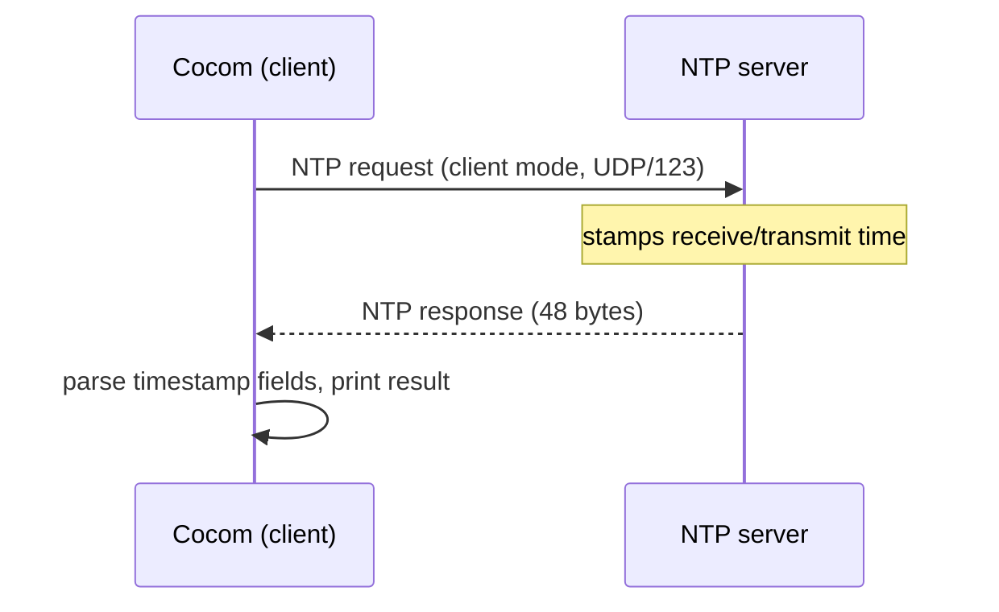

# Cocom

[](https://github.com/LamdaLamdaLamda/cocom/actions/workflows/linux.yml)
[](https://github.com/LamdaLamdaLamda/cocom/actions/workflows/macos.yml)
[](https://github.com/LamdaLamdaLamda/cocom/actions/workflows/docker-image.yml)
[](LICENSE)

Cocom is a minimal [NTP](http://www.ntp.org/) client, written entirely in Rust. It speaks the NTP wire protocol
directly over UDP — no `ntpd`, `chrony`, `systemd-timesyncd`, or third-party NTP library involved.

## Why

- **No system daemon required.** Cocom talks UDP directly to an NTP server, which makes it a good fit for
  embedded targets and minimal Linux environments where running a full NTP daemon isn't practical.
- **Built for systems that need direct control over time sync.** Real-time and signal-processing workloads,
  embedded devices, and other resource-constrained or tightly controlled environments often can't — or
  shouldn't have to — depend on an external system daemon for something as fundamental as clock
  synchronization. Cocom gives you a single, self-contained binary you fully control.
- **Single, portable binary.** As a Rust binary it cross-compiles to x86, ARM, and RISC-V without code changes.
- **Memory-safe by construction.** Unlike `ntpd`/`chrony` (C), packet parsing happens in safe Rust — no
  buffer overflows, no use-after-free.

## Comparison

|                                  | Cocom                                       | `chrony`                     | `ntpd`                        | `systemd-timesyncd`  |
|----------------------------------|----------------------------------------------|-------------------------------|--------------------------------|------------------------|
| Language                        | Rust                                         | C                              | C                               | C                       |
| Memory-safe by design            | Yes                                           | No                              | No                               | No                       |
| Runtime dependency               | None — direct UDP, single binary             | System daemon + config        | System daemon + config         | Requires systemd        |
| Clock offset / drift correction  | Measured and optionally applied (`--apply`): gradual slew for offsets ≤128ms, hard step above | Yes, gradual slew | Yes, gradual slew | Yes, gradual slew |
| Typical use                      | One-shot time query/step, or a foreground polling loop (`--sync`), embeddable in other tools | Continuous system clock discipline | Continuous system clock discipline | Continuous system clock discipline |

## When to Use Cocom

Cocom is a good fit when:

- You need to query the current time from an NTP server without installing or configuring a full daemon
- You're building for embedded or minimal Linux targets where `chrony`/`ntpd` aren't available or desired
- You want to embed NTP time queries directly into another Rust program or a larger real-time/signal-processing
  pipeline
- Memory-safety of the client itself is a hard requirement

For read-only rootfs, static-IP/no-DNS setups, running without `systemd`, and provisioning
`--auth-key-file` across a device fleet, see
**[docs/embedded-deployment.md](docs/embedded-deployment.md)**.

Cocom is **not** a drop-in replacement for `chrony`/`ntpd`/`systemd-timesyncd` yet:

- `--apply` slews small offsets (≤128ms) but still **steps** large ones (a hard jump, which can make
  timestamps briefly go backwards) — `chrony`/`ntpd` avoid sudden jumps more thoroughly, e.g. by
  slewing over a longer period instead of ever stepping once past their initial sync.
- Response authentication (`--auth-key-file`) only covers symmetric-key HMAC against a self-hosted
  server whose key you control — no NTS, and there's no multi-server comparison. Without a key
  configured, Cocom trusts a single server's response completely, bounded only by the 1000s
  sanity threshold.
- The drift estimate is a linear regression over a sliding window of the last 8 samples, with a
  minimum-delay filter for the reported "best" offset — noticeably more stable than a naive two-point
  estimate, but still not `chrony`'s full clock-filter/selection algorithm (see
  [Precision & Limitations](#precision--limitations))

If you need continuous, drift-corrected time synchronization today, use `chrony` or `ntpd`.

## Features

- Sends an NTP client-mode request (RFC 5905) and parses the 48-byte response packet
- Configurable NTP server (defaults to the [PTB Braunschweig](https://www.ptb.de) time server)
- Configurable UDP bind address
- Round-trip delay and clock-offset calculation from the four NTP timestamps (`-o`/`--offset`, also
  included in verbose output)
- Periodic re-synchronization with sliding-window clock-drift estimation and minimum-delay
  sample filtering (`-s`/`--sync`, `-i`/`--interval`)
- Applies the measured offset to the system clock (`-a`/`--apply`, requiring elevated privileges):
  a gradual slew for small offsets, a hard step for large ones, refusing implausibly large
  corrections unless `-f`/`--force-large-step` is given; combinable with `--sync` for repeated
  corrections using the window-filtered offset
- Persists the sliding window to disk (`--state-file <PATH>`), so drift estimation survives
  restarts instead of starting from scratch — works with `--sync` and with repeated one-shot
  `--apply` runs (e.g. from cron)
- Authenticates requests/responses via a symmetric-key HMAC-SHA256 MAC (`--auth-key-file <PATH>`),
  fails closed on a missing/invalid signature or a replayed response; opt-in, and only useful
  against a self-hosted server whose key you control (see
  [docs/ntp-response-authentication.md](docs/ntp-response-authentication.md))
- Verbose and debug output modes for inspecting raw NTP packet fields

> **Note:** By default Cocom only measures and reports clock offset, round-trip delay, and (in `--sync`
> mode) an estimated drift rate. `--apply` opts in to actually stepping the system clock — see
> [When to Use Cocom](#when-to-use-cocom) for step vs. slew, and the [roadmap](#roadmap) and
> [Changelog](CHANGELOG.md) for what has actually shipped.

## Installation

### Build from source

Requires [`just`](https://just.systems) as the command runner.

```sh
just build && just install
```

This installs Cocom to `/usr/local/bin`; the install step may need elevated privileges. To build and run
without installing:

```sh
just run-dev   # debug build
just run       # release build
```

### Docker

```sh
docker build -t cocom . && docker run cocom
```

## Usage

If no host is given, Cocom queries the default NTP server. With no flags, it prints the received time.

```
NTP-Client purely written in Rust.

Usage: cocom [OPTIONS] [HOST]

Arguments:
  [HOST]  Specifies the desired NTP-server

Options:
  -b, --bind <BIND>           Binding address for the UDP socket (IP:PORT)
  -v, --verbose               Activates terminal output
  -d, --debug                 Prints the fields of the received NTP-packet
  -o, --offset                Prints the round-trip delay and clock offset
  -s, --sync                  Continuously polls, reporting offset and drift
  -i, --interval <SECONDS>    Poll interval for --sync, in seconds [default: 64]
  -a, --apply                 Applies the offset to the system clock
  -f, --force-large-step      Allows a correction beyond the 1000s sanity limit
      --state-file <PATH>     Persists the sliding window across runs
      --auth-key-file <PATH>  Verifies responses via a symmetric key file (see docs)
  -h, --help                  Print help
  -V, --version               Print version
```

See [docs/sync-and-clock-correction.md](docs/sync-and-clock-correction.md) for what `--apply`,
`--force-large-step`, and `--state-file` actually do in detail.

Examples:

Plain invocation against the default server — no flags needed, just the parsed date/time:

```sh
$ cocom
2026-08-08 23:07:56.528642832
```

Verbose mode: shows the outgoing request, the full raw NTP packet fields, and — since it now also
includes it — the measured clock offset/delay at the end:

```sh
$ cocom -v pool.ntp.org
[*] Requesting pool.ntp.org:123
[*] Received NTP-data...
[*] Time 1786265691 sec : 396831919 nsec
[*] NTP-Data -->
	Mode - 28
	Stratum - 2
	Poll - 0
	Precision - 233
	Root-Delay - 2091
	Root-Dispersion - 252
	Reference-ID - 1365776101
	Reference-Timestamp - 3995254472:4093032633
	Originate-Timestamp - 0:0
	RX-Timestamp - 3995254491:1704380116
	TX-Timestamp - 3995254491:1704472332
```

Offset-only mode: just the clock offset and round-trip delay, without the rest of the verbose output —
handy for scripting or quick checks:

```sh
$ cocom -o pool.ntp.org
[*] Clock offset: 48.212 ms (local clock is behind the server)
[*] Round-trip delay: 104.456 ms
```

Applying the measured offset requires elevated privileges (`sudo` or equivalent). Without them, the
attempt fails cleanly instead of silently doing nothing — this is the actual output running unprivileged:

```sh
$ cocom -o --apply pool.ntp.org
[*] Clock offset: 78.198 ms (local clock is behind the server)
[*] Round-trip delay: 148.677 ms
[-] Error: Operation not permitted (os error 1)
```

With `sudo`, the outcome instead depends on the offset's size — skipped, gradually slewed, hard-stepped,
or refused outright above a sanity threshold; see
[docs/sync-and-clock-correction.md](docs/sync-and-clock-correction.md#system-clock-correction---apply)
for the exact thresholds and why they're set where they are.

Continuous sync mode: re-queries the server every `--interval` seconds and reports the raw per-poll
offset/delay, the minimum-delay ("best") offset in the sliding window, and a regression-based drift
estimate, until you stop it with `Ctrl-C`. See
[docs/sync-and-clock-correction.md](docs/sync-and-clock-correction.md#sliding-window-drift-estimation)
for why the estimate below settles down and `best` stays stable through a jittery poll (window 6/8) as
the window fills:

```sh
$ cocom -s -i 4 pool.ntp.org
[*] Syncing with pool.ntp.org every 4s (Ctrl-C to stop)
[*] 2026-08-11 12:06:43.540391190  offset: +30.339 ms  delay: 52.893 ms  drift: n/a (warming up, window: 1/8)
[*] 2026-08-11 12:06:47.569220448  offset: +15.413 ms  delay: 22.017 ms  drift: -3705.103 ppm  (best: +15.413 ms, window: 2/8)
[*] 2026-08-11 12:06:51.615929067  offset: +24.976 ms  delay: 41.550 ms  drift: -661.752 ppm  (best: +15.413 ms, window: 3/8)
[*] 2026-08-11 12:06:55.641967666  offset: +15.008 ms  delay: 22.329 ms  drift: -901.755 ppm  (best: +15.413 ms, window: 4/8)
[*] 2026-08-11 12:06:59.670235075  offset: +16.663 ms  delay: 25.549 ms  drift: -687.745 ppm  (best: +15.413 ms, window: 5/8)
[*] 2026-08-11 12:07:03.695274228  offset: -27.481 ms  delay: 107.644 ms  drift: -2091.134 ppm  (best: +15.413 ms, window: 6/8)
[*] 2026-08-11 12:07:07.812050164  offset: +17.473 ms  delay: 25.102 ms  drift: -1173.280 ppm  (best: +15.413 ms, window: 7/8)
[*] 2026-08-11 12:07:11.835092878  offset: +15.447 ms  delay: 21.548 ms  drift: -736.259 ppm  (best: +15.447 ms, window: 8/8)
[*] 2026-08-11 12:07:15.858119802  offset: +15.114 ms  delay: 20.944 ms  drift: -256.731 ppm  (best: +15.114 ms, window: 8/8)
[*] 2026-08-11 12:07:19.885659966  offset: +14.685 ms  delay: 22.296 ms  drift: -91.366 ppm  (best: +15.114 ms, window: 8/8)
^C
```

Persisting the sliding window (`--state-file`) so drift estimation survives a restart instead of
starting from scratch — this is the actual output restarting after 4 prior polls, with the same file:

```sh
$ cocom -s -i 3 --state-file /var/lib/cocom/state pool.ntp.org
[*] Syncing with pool.ntp.org every 3s (Ctrl-C to stop)
[*] Loaded 4 persisted sample(s)
[*] 2026-08-12 17:13:45.822377801  offset: +25.646 ms  delay: 31.223 ms  drift: +319.694 ppm  (best: +16.649 ms, window: 5/8)
```

Note the window starts at 5/8, not 1/8 — see
[docs/sync-and-clock-correction.md](docs/sync-and-clock-correction.md#state-persistence---state-file)
for how this also benefits repeated one-shot `--apply` runs (e.g. from cron), not just `--sync`.

Authenticating requests/responses against a self-hosted server (`--auth-key-file`) — the key file
is a plain-text `KEYID SECRET` pair per line:

```
$ cat /etc/cocom/auth.keys
1 correct-horse-battery-staple
```

```sh
cocom -v --auth-key-file /etc/cocom/auth.keys my-self-hosted-ntp.example.com
```

Cocom's own default server doesn't understand the trailer, so pointing `--auth-key-file` at it
fails closed instead of silently falling back to an unauthenticated response — this is the actual
output:

```sh
$ cocom -v --auth-key-file /etc/cocom/auth.keys
[*] Requesting 192.53.103.108:123
[-] Error: Resource temporarily unavailable (os error 35)
```

See [docs/ntp-response-authentication.md](docs/ntp-response-authentication.md) for the full design
and why only a self-hosted server whose key you control can work with this flag.

Binding the UDP socket to a specific local address/port, combined with debug mode to inspect the raw
packet fields of the response:

```sh
cocom -b 0.0.0.0:12345 -d pool.ntp.org
```

## How it works

Cocom builds a 48-byte NTP packet in client mode, sends it over UDP to the target server's port 123, and
parses the returned packet's timestamp fields. See [RFC 5905, section 7](https://tools.ietf.org/html/rfc5905#section-7)
for the wire format.



## Architecture

| Module           | Responsibility                                                                              |
|-------------------|-----------------------------------------------------------------------------------------------|
| `src/main.rs`     | Entry point; parses CLI arguments and maps errors to process exit codes                       |
| `src/parser.rs`   | CLI argument definitions (`clap`) and dispatch to verbose/debug/default/offset/sync output modes; owns `Client` creation per request (fresh client per poll in `--sync` mode) |
| `src/client.rs`   | UDP socket handling: sends the request (recording T1), receives the response (recording T4), times out after 5s, and computes the `SyncResult` |
| `src/ntp.rs`      | The 48-byte NTP packet: (de)serialization and NTP-timestamp ⟷ `Duration`/nanosecond conversions |
| `src/offset.rs`   | Pure round-trip-delay/clock-offset math ([RFC 5905, section 8](https://tools.ietf.org/html/rfc5905#section-8)) for a single request, decoupled from I/O |
| `src/drift.rs`    | `SlidingWindow`: keeps the last 8 samples, picks the minimum-delay ("best") offset, and estimates drift via linear regression across the window; plus offset extrapolation — used by `--sync`, decoupled from I/O and the system clock |
| `src/clock.rs`    | `plan_correction` (pure decision: skip/slew/step/refuse) plus `slew_clock` (`adjtime(2)`) and `step_clock` (`clock_settime(2)`), both unsafe `libc` FFI — applies a measured offset to the system clock when `--apply` is set, refusing implausibly large corrections unless `--force-large-step` overrides it |
| `src/state.rs`    | Loads/saves a `SlidingWindow`'s samples to a plain-text file (`--state-file`), so drift estimation survives restarts; a missing/corrupt/stale file is a cold start, not an error |
| `src/auth.rs`     | Symmetric-key HMAC-SHA256 request signing/response verification (`--auth-key-file`): key file loading, MAC computation/constant-time verification, and the `[ Key ID \| digest ]` trailer, decoupled from `ntp.rs`'s 48-byte wire format |

## Precision & Limitations

- The default output (`cocom [HOST]`) prints the server's timestamp as-is — it is **not** corrected for
  round-trip delay or clock offset. Use `-o`/`--offset` (or `-v`) to see the actual offset and delay
  measurement.
- Outside of `--sync`, a single request/response exchange is performed per invocation — no averaging over
  multiple samples or retry-on-loss.
- By default the measured offset/delay/drift are reported, not applied. `-a`/`--apply` opts in to
  actually correcting the system clock and requires elevated privileges.
- The UDP socket read has a fixed 5-second timeout; on timeout or network error, a single-shot invocation
  exits with a non-zero status, while `--sync` logs the error and continues polling on the next interval.
  The same applies to a failed clock-correction attempt (e.g. missing privileges): fatal for a one-shot
  `--apply`, logged-and-continued for `--sync --apply`.

For the full detail — the offset/delay math, why the sliding-window drift estimate beats a naive
two-point one, and the exact skip/slew/step/refuse thresholds behind `--apply` and why they're set
where they are — see **[docs/sync-and-clock-correction.md](docs/sync-and-clock-correction.md)**.

## Roadmap

- [x] Round-trip delay and clock-offset calculation from the four NTP timestamps
- [x] Periodic re-synchronization with drift compensation
- [x] Dependency modernization (replace unmaintained/advisory-flagged crates)
- [x] Sliding-window drift estimation (minimum-delay sample filtering + regression across the last
      N samples, instead of a two-point estimate) to make `--sync`'s drift readings more
      trustworthy
- [x] System clock correction — apply the measured offset via `-a`/`--apply` (hard step)
- [x] **Sanity/panic threshold for `--apply`** — refuses corrections larger than 1000s
      (matching classic `ntpd`'s "panic" behavior) unless `-f`/`--force-large-step` overrides it.
      Guards against an implausible correction from a misconfigured or badly wrong server.
- [x] **NTP response authentication (symmetric-key HMAC-SHA256)** — `--auth-key-file <PATH>`
      signs requests and fails closed on an unverified or replayed response, guarding against a
      spoofed response from a network attacker. Only covers a self-hosted server whose key you
      control, not NTS and not Cocom's own public default server; see
      [docs/ntp-response-authentication.md](docs/ntp-response-authentication.md).
- [ ] **Multi-server comparison / outlier rejection** — Cocom queries exactly one server and
      trusts it entirely; there's no comparison against multiple sources to detect and reject a
      single bad ("falseticker") server, unlike `chrony`/`ntpd`'s selection algorithms.
- [x] Gradual clock slewing (`adjtime`) for small offsets (≤128ms), avoiding backwards-moving
      timestamps; larger offsets still use a hard step, since slewing them would take
      impractically long
- [x] Persist the sliding window across restarts (`--state-file`) — works with `--sync` and
      with repeated one-shot `--apply` runs (e.g. from cron), instead of every invocation
      starting cold

## Development

Recipes are defined in the [justfile](justfile) and run via [`just`](https://just.systems).

| Command          | Description                                  |
|------------------|-----------------------------------------------|
| `just build-dev` | Debug build                                   |
| `just build`     | Release build                                 |
| `just run-dev`   | Build and run (debug)                         |
| `just run`       | Build and run (release)                       |
| `just test`      | Run the test suite                            |
| `just doc`       | Generate documentation into `doc/`            |
| `just install`   | Install the release binary to `$PREFIX/bin`   |

## Contributing

Issues and pull requests are welcome — see [CONTRIBUTING.md](CONTRIBUTING.md) for the full process. Please
run `just test` before submitting a change, and keep packet parsing/serialization changes aligned with
[RFC 5905](https://tools.ietf.org/html/rfc5905#section-7).

## License

GPL-3.0 — see [LICENSE](LICENSE).

## Further reading

- [docs/embedded-deployment.md](docs/embedded-deployment.md) — running Cocom on embedded Linux/UNIX
- [NTP.org](http://www.ntp.org/)
- [RFC 5905](https://tools.ietf.org/html/rfc5905#section-7)
- [NTP Pool Project](https://www.ntppool.org/en/)
